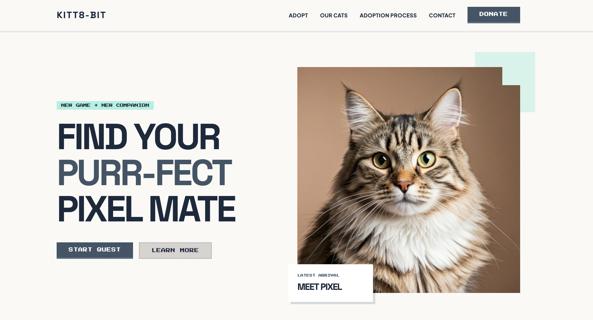

<p align="center">
  
  
</p>

<p align="center">
  <a href="https://github.com/eduardamirelly/cat-adoption-website/issues/new/choose">Report Bug</a>
  ·
  <a href="https://github.com/eduardamirelly/cat-adoption-website/issues/new/choose">Suggestions</a>
</p>

## 💻 Project

A landing page for a cat adoption shelter, featuring a retro-modern "Nostalgic Gallery" aesthetic with pixel-art accents, bold typography, and a warm color palette. Designed to connect cats with their future families.

## ✨ Technologies

-   [x] Astro
-   [x] TailwindCSS

## 🚀 Deploy

-   [ ] Vercel

## 🔖 Layout

The layout was generated using [Stitch Beta](https://stitch.withgoogle.com/) from Google.

## 🏁 Running the project

### First Step [Install dependencies]

```sh
pnpm install
```

### Second Step [Run]

```sh
pnpm dev
```

## 📄 License

This project is under the MIT license. See the [LICENSE](LICENSE) file for more details.
